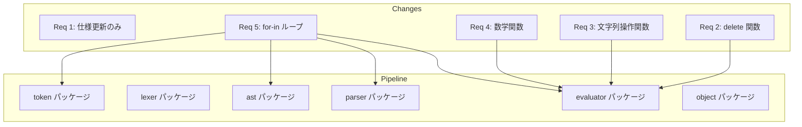
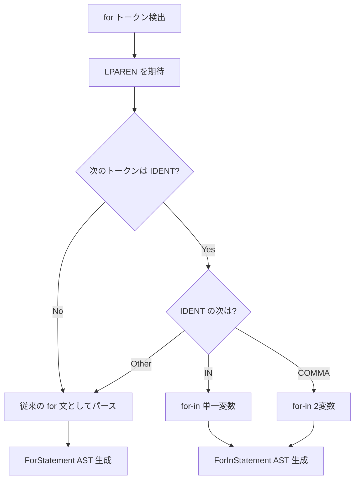

# Design Document — Phase 4: 汎用プログラミング機能

## Overview

**Purpose**: Sugu 言語を汎用プログラミング言語として実用的に使えるようにするための機能群を追加する。
**Users**: Sugu 言語のユーザーが、文字列操作・数学計算・コレクションイテレーションを含む実用的なプログラムを記述できるようになる。
**Impact**: `evaluator/builtins.go` に組み込み関数を追加し、`token/` → `ast/` → `parser/` → `evaluator/` の全層に for-in ループ構文を追加する。

### Goals
- 剰余演算子の仕様ドキュメント整備（実装は完了済み）
- マップのキー削除機能（`delete`）の追加
- 文字列操作関数 8 種の追加（マルチバイト対応）
- 数学関数 9 種の追加
- for-in ループ構文の追加（配列・マップ対応）

### Non-Goals
- モジュールシステム（import）— Phase 5 以降
- Unicode 変数名 — Lexer のリファクタリングが必要、将来対応
- 負のインデックス / スライス操作 — 将来対応
- try/catch/finally の finally ブロック — 将来対応
- 組み込み関数への Environment 渡し（const チェック強化）— 将来対応

## Architecture

### Existing Architecture Analysis

既存のインタプリタパイプライン:

```
ソース → Lexer → Token列 → Parser → AST → Evaluator → Object
```

- **Req 1 (剰余)**: 変更不要（既に `math.Mod` 実装済み）。仕様更新のみ
- **Req 2, 3, 4 (組み込み関数)**: `evaluator/builtins.go` の `builtins` マップにエントリ追加。パイプライン上流の変更なし
- **Req 5 (for-in)**: 全層に変更が必要 — Token 追加 → Lexer キーワード認識 → AST ノード追加 → Parser 構文解析 → Evaluator 評価

### Architecture Pattern & Boundary Map



**Architecture Integration**:
- **Selected pattern**: 既存のパイプライン拡張。新パッケージは追加しない
- **Domain boundaries**: 各パッケージの単一責任を維持（token は定義のみ、parser は解析のみ）
- **Existing patterns preserved**: 組み込み関数の `builtins` マップパターン、Environment チェーンによるスコープ管理
- **Steering compliance**: レイヤードアーキテクチャ、循環依存なし

### Technology Stack

| Layer | Choice / Version | Role in Feature | Notes |
|-------|------------------|-----------------|-------|
| Language | Go 1.25+ | 全実装 | 変更なし |
| Std Library | `strings`, `math`, `math/rand`, `unicode/utf8` | 文字列操作・数学関数の内部実装 | 新規依存なし |

## System Flows

### for-in ループのパース判定フロー



## Requirements Traceability

| Requirement | Summary | Components | Interfaces | Flows |
|-------------|---------|------------|------------|-------|
| 1.1, 1.2, 1.3 | 剰余演算子の浮動小数点対応 | — (実装済み) | — | — |
| 2.1, 2.2, 2.3, 2.4 | delete 関数 | Builtins | delete(map, key) | — |
| 3.1〜3.9 | 文字列操作関数 | Builtins | split, join, trim, replace, substring, indexOf, toUpper, toLower | — |
| 4.1〜4.10 | 数学関数 | Builtins | abs, floor, ceil, round, min, max, random, sqrt, pow | — |
| 5.1〜5.8 | for-in ループ | Token, AST, Parser, Evaluator | ForInStatement | for-in パース判定 |
| 6.1〜6.3 | 仕様ドキュメント更新 | docs/ | — | — |

## Components and Interfaces

| Component | Domain/Layer | Intent | Req Coverage | Key Dependencies | Contracts |
|-----------|-------------|--------|--------------|------------------|-----------|
| IN Token | token | for-in キーワードの定義 | 5.8 | — | — |
| ForInStatement | ast | for-in ループの AST ノード | 5.1〜5.8 | token (P0) | — |
| parseForInStatement | parser | for-in 構文の解析 | 5.1〜5.8 | ast (P0), token (P0) | — |
| evalForInStatement | evaluator | for-in の評価ロジック | 5.1〜5.7 | object (P0), ast (P0) | — |
| delete builtin | evaluator | マップキー削除 | 2.1〜2.4 | object (P0) | Service |
| 文字列操作 builtins | evaluator | 8 つの文字列操作関数 | 3.1〜3.9 | strings stdlib (P0) | Service |
| 数学 builtins | evaluator | 9 つの数学関数 | 4.1〜4.10 | math stdlib (P0) | Service |

### Token 層

#### IN Token

| Field | Detail |
|-------|--------|
| Intent | `in` キーワードを認識するトークン定義 |
| Requirements | 5.8 |

**Responsibilities & Constraints**
- `token.go` に `IN = "IN"` 定数を追加
- `keywords` マップに `"in": IN` を追加
- 既存の識別子 `in` が予約語になる（組み込み関数 `in()` との衝突に注意）

**Implementation Notes**
- `in` は既存の組み込み関数名と同名。for-in 構文でのみキーワードとして扱う必要がある
- **対策**: `in` を予約語にはせず、パーサーレベルで `for (` の後のコンテキストで `in` 識別子を検出する。これにより `in()` 組み込み関数との互換性を維持

### AST 層

#### ForInStatement

| Field | Detail |
|-------|--------|
| Intent | for-in ループを表現する AST ノード |
| Requirements | 5.1〜5.8 |

**Contracts**: State

##### State Management

```go
type ForInStatement struct {
    Token    token.Token     // 'for' トークン
    Key      *Identifier     // 第1イテレーション変数（インデックス/キー、または単一値）
    Value    *Identifier     // 第2イテレーション変数（値、nil の場合は単一変数形式）
    Iterable Expression      // イテレート対象の式
    Body     *BlockStatement // ループ本体
}
```

- Key: 配列の場合はインデックスまたは値、マップの場合はキー
- Value: 2変数形式の場合のみ使用。nil の場合は単一変数形式
- 単一変数 `for (x in arr)`: Key=x, Value=nil → 配列なら値、マップならキーを受け取る

### Parser 層

#### parseForInStatement

| Field | Detail |
|-------|--------|
| Intent | for-in 構文を検出・解析して ForInStatement を生成 |
| Requirements | 5.1〜5.8 |

**Responsibilities & Constraints**
- `parseForStatement` 内で分岐: `(` の後に IDENT が来て、次が識別子 `"in"` または COMMA なら for-in として委譲
- 単一変数形式: `for (item in expr) { ... }`
- 2変数形式: `for (key, value in expr) { ... }`
- `in` はトークンレベルの予約語にしない（コンテキスト依存で判定）

**Implementation Notes**
- Lookahead: 現在の `peekToken` に加え、`for (` IDENT の次のトークンを確認する必要がある
- 方法: `parseForStatement` 内で `(` を消費後、curToken が IDENT かつ peekToken.Literal が `"in"` なら for-in
- 2変数: curToken が IDENT かつ peekToken が COMMA なら、COMMA 消費 → 2番目の IDENT → `"in"` を確認

### Evaluator 層

#### evalForInStatement

| Field | Detail |
|-------|--------|
| Intent | ForInStatement を評価し、配列・マップをイテレート |
| Requirements | 5.1〜5.7 |

**Responsibilities & Constraints**
- 新しいスコープ（`NewEnclosedEnvironment`）を作成
- イテレーション変数を `SetConst` で設定（再代入禁止）
- 配列: 単一変数→値、2変数→(インデックス, 値)
- マップ: 単一変数→キー、2変数→(キー, 値)
- break/continue/return のハンドリングは既存の `evalForStatement` と同じパターン

**Contracts**: Service

##### Service Interface

```go
// evalForInStatement は for-in ループを評価する
// Preconditions: node.Iterable の評価結果が Array または Map
// Postconditions: ループ完了後 NULL を返す（break/return の場合はその値）
func evalForInStatement(node *ast.ForInStatement, env *object.Environment) object.Object
```

- Preconditions: Iterable が Array か Map であること
- Postconditions: break 時は NULL、return 時は ReturnValue を返す
- Invariants: イテレーション変数はループ内で const

#### delete Builtin

| Field | Detail |
|-------|--------|
| Intent | マップからキーを削除する組み込み関数 |
| Requirements | 2.1〜2.4 |

**Contracts**: Service

##### Service Interface

```go
// delete(map, key) → true/false
// Preconditions: 第1引数が Map、第2引数が Hashable
// Postconditions: キーが存在すれば削除して true、存在しなければ false
// Error: 引数の型が不正な場合は Error オブジェクト
```

**Implementation Notes**
- `object.Map.Pairs` から Go の `delete()` でキーを削除
- const チェックは組み込み関数レベルでは実装しない（Environment にアクセスできないため）。将来の改善対象として `research.md` に記録済み

#### 文字列操作 Builtins

| Field | Detail |
|-------|--------|
| Intent | 8 つの文字列操作組み込み関数 |
| Requirements | 3.1〜3.9 |

**Contracts**: Service

##### Service Interface

```go
// 各関数のシグネチャ
// split(str, sep) → Array of String
// join(arr, sep) → String
// trim(str) → String
// replace(str, old, new) → String
// substring(str, start, end) → String  // rune 単位
// indexOf(str, substr) → Number        // rune 単位、見つからない場合 -1
// toUpper(str) → String
// toLower(str) → String
```

**Implementation Notes**
- Go 標準の `strings` パッケージを活用: `strings.Split`, `strings.Join`, `strings.TrimSpace`, `strings.ReplaceAll`, `strings.ToUpper`, `strings.ToLower`
- `substring`: `[]rune(str)[start:end]` で rune 単位スライス。範囲外アクセスはエラー
- `indexOf`: `strings.Index` はバイト位置を返すため、rune 位置への変換が必要。`[]rune` 変換後にスキャン、または `utf8.RuneCountInString` で変換

#### 数学 Builtins

| Field | Detail |
|-------|--------|
| Intent | 9 つの数学組み込み関数 |
| Requirements | 4.1〜4.10 |

**Contracts**: Service

##### Service Interface

```go
// 各関数のシグネチャ
// abs(x) → Number          // math.Abs
// floor(x) → Number        // math.Floor（負方向切り捨て）
// ceil(x) → Number         // math.Ceil
// round(x) → Number        // math.Round
// min(a, b, ...) → Number  // 可変長引数、最低1つ
// max(a, b, ...) → Number  // 可変長引数、最低1つ
// random() → Number        // 0以上1未満
// sqrt(x) → Number         // math.Sqrt
// pow(x, y) → Number       // math.Pow
```

**Implementation Notes**
- `math` パッケージを直接使用
- `min`/`max` は可変長引数: 引数が 0 個の場合はエラー
- `random()` は `rand.Float64()` を使用。Go 1.25 では `math/rand/v2` が利用可能だが、互換性のため `math/rand` を使用
- `floor` と `int()` の違い: `floor(-3.7)` → `-4`, `int(-3.7)` → `-3`（Truncation vs Floor）

## Error Handling

### Error Strategy

既存のエラーハンドリングパターン（`newError` / `newErrorWithPos`）を踏襲する。

### Error Categories and Responses

**User Errors**:
- 引数の型不一致 → `"argument to \`funcName\` must be TYPE, got TYPE"` 形式
- 引数の数不一致 → `"wrong number of arguments. got=N, want=M"` 形式
- 範囲外アクセス（substring） → `"substring index out of range"` 形式

**Business Logic Errors**:
- for-in の対象が Array/Map 以外 → `"for-in requires ARRAY or MAP, got TYPE"` 形式

## Testing Strategy

### Unit Tests
- **evaluator_test.go**: 各組み込み関数の正常系・異常系・エッジケース
  - delete: 存在するキー、存在しないキー、型エラー
  - 文字列操作: 空文字列、マルチバイト文字（日本語）、境界値
  - 数学関数: 正数・負数・ゼロ、NaN、Inf
  - for-in: 配列（単一変数/2変数）、マップ（単一変数/2変数）、空コレクション、break/continue
- **parser_test.go**: for-in 構文の AST 生成テスト
  - 単一変数形式、2変数形式、ネスト

### Integration Tests
- for-in + break/continue の組み合わせ
- for-in + 関数呼び出し（クロージャ内でのイテレーション）
- 文字列操作の組み合わせ（split → join のラウンドトリップ）
