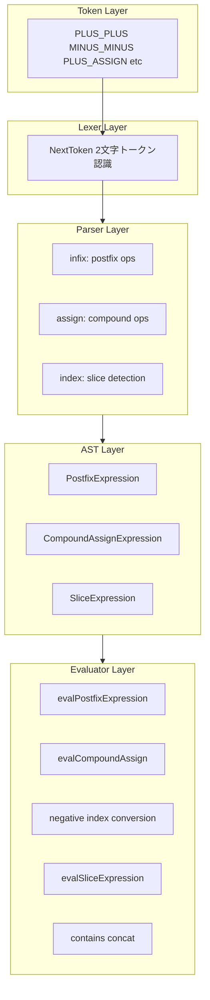
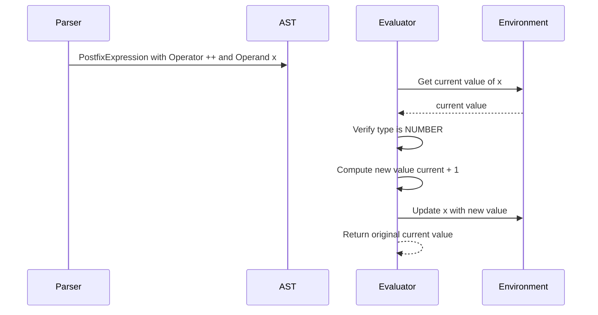
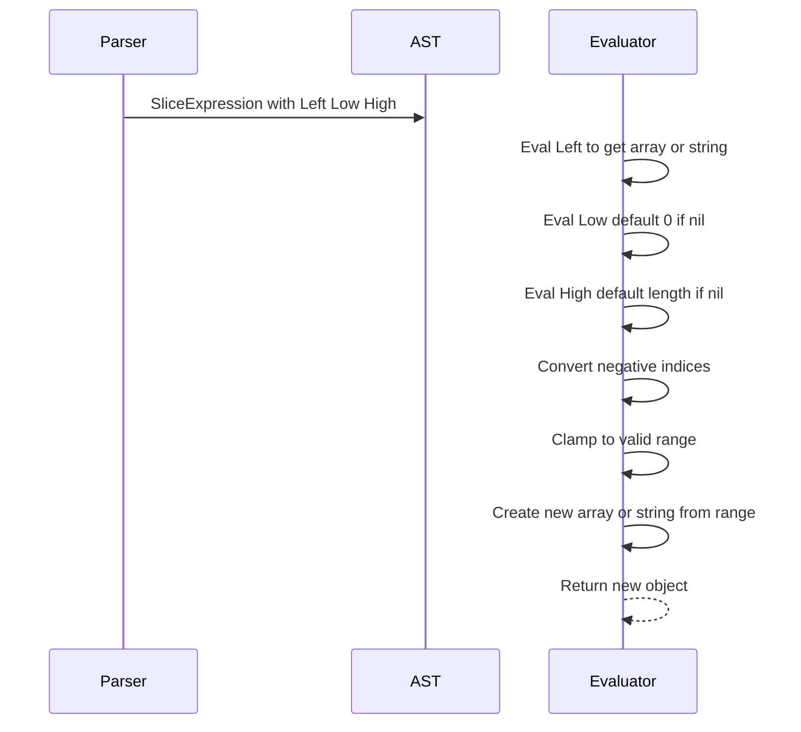

# Design Document: Phase 5 — 構文糖衣と配列ユーティリティ

## Overview

**Purpose**: Sugu 言語の書きやすさを向上させる構文糖衣（インクリメント/デクリメント、複合代入演算子）と配列ユーティリティ（負インデックス、スライス操作、`contains`/`concat` 関数）を提供する。

**Users**: Sugu 言語ユーザーが、`i = i + 1` → `i++`、`arr[len(arr)-1]` → `arr[-1]`、ループ内での `push` 繰り返し → `concat` のように、より簡潔にコードを記述するために使用する。

**Impact**: Lexer、Parser、AST、Evaluator の全レイヤーに変更が及ぶ。既存の演算子・インデックス処理を拡張し、新しいトークン・AST ノード・評価ロジックを追加する。

### Goals
- `++`/`--` と `+=`/`-=`/`*=`/`/=`/`%=` による簡潔な変数更新
- `arr[-1]` による末尾要素アクセスと `arr[1:3]` によるスライス操作
- `contains()` と `concat()` による配列ユーティリティの強化
- 既存機能への回帰なし

### Non-Goals
- 前置インクリメント/デクリメント（`++i`, `--i`）
- スライス代入（`arr[1:3] = [...]`）
- ステップ付きスライス（`arr[::2]`）
- 文字列に対する `contains` 以外の新しいメソッド構文

## Architecture

### Existing Architecture Analysis

Sugu のインタプリタパイプラインは `Lexer → Parser → Evaluator` の 3 層構造。各レイヤーの拡張ポイント:

| レイヤー | 変更対象ファイル | 拡張内容 |
|---------|----------------|---------|
| Token | `token/token.go` | 7 トークン追加 |
| Lexer | `lexer/lexer.go` | 2文字トークンの認識ロジック追加 |
| AST | `ast/ast.go` | 3 ノード追加 |
| Parser | `parser/parser.go` | 後置演算子・複合代入・スライス式のパース |
| Evaluator | `evaluator/evaluator.go` | 新 AST ノードの評価、負インデックス変換 |
| Builtins | `evaluator/builtins.go` | `contains`, `concat` 関数追加 |

既存パターン:
- 新トークンは `token.go` の定数に追加し、Lexer の `NextToken()` で認識
- 新 AST ノードは `ast.go` に構造体定義し、`statementNode()`/`expressionNode()` + `TokenLiteral()` + `String()` を実装
- 新パース関数は `parser.go` の prefix/infix 関数マップに登録
- 新評価は `evaluator.go` の `Eval()` switch 文に case 追加

### Architecture Pattern & Boundary Map



**Architecture Integration**:
- 選択パターン: 既存パイプライン拡張（新レイヤーの追加なし）
- 既存パターン維持: Pratt Parser の prefix/infix 登録、Environment チェーンによるスコープ管理
- 新コンポーネントの理由: 各 AST ノードは異なるセマンティクスを持つため個別に定義

### Technology Stack

| Layer | Choice / Version | Role in Feature | Notes |
|-------|------------------|-----------------|-------|
| Runtime | Go 1.25+ | 全コンポーネントの実装言語 | 変更なし |
| Math | `math` 標準ライブラリ | `%=` でのゼロ除算判定 | 既存で使用済み |
| Strings | `strings` 標準ライブラリ | `contains` での文字列検索 | `strings.Contains` を使用 |

新しい外部依存は不要。

## System Flows

### 後置インクリメント/デクリメントの評価フロー



### スライス式の評価フロー



## Requirements Traceability

| Requirement | Summary | Components | Interfaces | Flows |
|-------------|---------|------------|------------|-------|
| 1.1, 1.2 | 後置 `++`/`--` の評価 | PostfixExpression, Evaluator | evalPostfixExpression | 後置評価フロー |
| 1.3, 1.4 | const/型エラー | Evaluator | evalPostfixExpression | — |
| 1.5 | パーサー対応 | Parser | parsePostfixExpression | — |
| 1.6 | トークン認識 | Token, Lexer | NextToken | — |
| 2.1–2.5 | 複合代入の評価 | CompoundAssignExpression, Evaluator | evalCompoundAssign | — |
| 2.6, 2.7 | const/ゼロ除算エラー | Evaluator | evalCompoundAssign | — |
| 2.8 | インデックス複合代入 | IndexCompoundAssignExpression, Evaluator | evalIndexCompoundAssign | — |
| 2.9, 2.10 | トークン・パーサー | Token, Lexer, Parser | NextToken, parseExpression | — |
| 3.1–3.4 | 負インデックス読み取り | Evaluator | evalArrayIndexExpression, evalStringIndexExpression | — |
| 3.5, 3.6 | 負インデックス代入 | Evaluator | evalArrayIndexAssignment | — |
| 4.1–4.8 | スライス操作 | SliceExpression, Evaluator | evalSliceExpression | スライス評価フロー |
| 4.9 | スライスパーサー | Parser | parseIndexExpression | — |
| 5.1–5.6 | contains 関数 | Builtins | contains | — |
| 6.1–6.6 | concat 関数 | Builtins | concat | — |
| 7.1–7.3 | ドキュメント更新 | docs/ | — | — |

## Components and Interfaces

| Component | Domain | Intent | Req Coverage | Key Dependencies | Contracts |
|-----------|--------|--------|--------------|------------------|-----------|
| Token 定義追加 | Token | 7 新トークンの定義 | 1.6, 2.9 | なし | — |
| Lexer 拡張 | Lexer | 2文字トークンの認識 | 1.6, 2.9 | Token (P0) | — |
| PostfixExpression | AST | 後置演算子の AST 表現 | 1.1, 1.2, 1.5 | Token (P0) | — |
| CompoundAssignExpression | AST | 複合代入の AST 表現 | 2.1–2.5, 2.10 | Token (P0) | — |
| IndexCompoundAssignExpression | AST | インデックス複合代入の AST 表現 | 2.8 | Token (P0) | — |
| SliceExpression | AST | スライス式の AST 表現 | 4.1–4.9 | Token (P0) | — |
| Parser 拡張 | Parser | 新構文のパース | 1.5, 2.10, 4.9 | Token (P0), AST (P0) | — |
| Evaluator 拡張 | Evaluator | 新 AST ノードの評価・負インデックス | 1–4 全体 | AST (P0), Object (P0) | Service |
| contains 関数 | Builtins | 配列・文字列の包含判定 | 5.1–5.6 | Object (P0) | Service |
| concat 関数 | Builtins | 配列の結合 | 6.1–6.6 | Object (P0) | Service |

### Token Layer

#### Token 定義追加

| Field | Detail |
|-------|--------|
| Intent | `++`, `--`, `+=`, `-=`, `*=`, `/=`, `%=` の 7 トークンを定義 |
| Requirements | 1.6, 2.9 |

**Responsibilities & Constraints**
- `token.go` の定数定義に以下を追加:

```
PLUS_PLUS       = "++"
MINUS_MINUS     = "--"
PLUS_ASSIGN     = "+="
MINUS_ASSIGN    = "-="
ASTERISK_ASSIGN = "*="
SLASH_ASSIGN    = "/="
PERCENT_ASSIGN  = "%="
```

### Lexer Layer

#### Lexer 拡張

| Field | Detail |
|-------|--------|
| Intent | 2文字演算子トークンの認識ロジックを `NextToken()` に追加 |
| Requirements | 1.6, 2.9 |

**Responsibilities & Constraints**
- `+` を読んだ後に `peekChar()` で次の文字を確認:
  - `+` → `PLUS_PLUS`
  - `=` → `PLUS_ASSIGN`
  - それ以外 → 従来の `PLUS`
- `-`, `*`, `/`, `%` についても同様に `=` を確認して複合代入トークンを生成
- 既存の `makeTwoCharToken` パターン（`==`, `!=`, `<=`, `>=` で使用）を踏襲

### AST Layer

#### PostfixExpression

| Field | Detail |
|-------|--------|
| Intent | `x++`, `x--` の後置演算式を表現 |
| Requirements | 1.1, 1.2, 1.5 |

**Structure**:

```go
type PostfixExpression struct {
    Token    token.Token  // ++ or -- token
    Operator string       // "++" or "--"
    Operand  Expression   // the variable being modified
}
```

- `expressionNode()`, `TokenLiteral()`, `String()` を実装
- `String()` は `(x++)` 形式で出力

#### CompoundAssignExpression

| Field | Detail |
|-------|--------|
| Intent | `x += y` 形式の複合代入を表現 |
| Requirements | 2.1–2.6, 2.10 |

**Structure**:

```go
type CompoundAssignExpression struct {
    Token    token.Token  // += -= *= /= %= token
    Name     *Identifier  // left-hand variable
    Operator string       // "+=" "-=" "*=" "/=" "%="
    Value    Expression   // right-hand expression
}
```

- `expressionNode()`, `TokenLiteral()`, `String()` を実装

#### IndexCompoundAssignExpression

| Field | Detail |
|-------|--------|
| Intent | `arr[i] += y` 形式のインデックス複合代入を表現 |
| Requirements | 2.8 |

**Structure**:

```go
type IndexCompoundAssignExpression struct {
    Token    token.Token    // += -= *= /= %= token
    Left     Expression     // the indexed expression (e.g., arr[i])
    Index    Expression     // index expression
    Operator string         // "+=" "-=" "*=" "/=" "%="
    Value    Expression     // right-hand expression
}
```

#### SliceExpression

| Field | Detail |
|-------|--------|
| Intent | `arr[1:3]`, `arr[:3]`, `arr[1:]`, `arr[:]` のスライス式を表現 |
| Requirements | 4.1–4.9 |

**Structure**:

```go
type SliceExpression struct {
    Token token.Token  // [ token
    Left  Expression   // the array/string being sliced
    Low   Expression   // start index (nil if omitted)
    High  Expression   // end index (nil if omitted)
}
```

- `Low` / `High` が `nil` の場合はそれぞれ 0 / length として評価時に処理

### Parser Layer

#### Parser 拡張

| Field | Detail |
|-------|--------|
| Intent | 後置演算子、複合代入演算子、スライス式のパースロジック |
| Requirements | 1.5, 2.10, 4.9 |

**後置演算子のパース**:
- `PLUS_PLUS` と `MINUS_MINUS` を infix 演算子として優先順位テーブルに登録（`POSTFIX` 優先順位を新設、`CALL` より低く `PREFIX` より高い位置）
- `parsePostfixExpression(left)` を infix パース関数として登録
- 左辺が `*ast.Identifier` であることを検証（変数以外は構文エラー）

**複合代入演算子のパース**:
- `parseExpression` 内の代入分岐（現在 `token.ASSIGN` のみ）を拡張し、`PLUS_ASSIGN` 等のトークンも処理
- 左辺が `*ast.Identifier` → `CompoundAssignExpression` を生成
- 左辺が `*ast.IndexExpression` → `IndexCompoundAssignExpression` を生成

**スライス式のパース**:
- `parseIndexExpression` を拡張:
  1. `[` の直後が `:` → `Low = nil`、`:` を消費して `High` をパース
  2. 式をパースした後に peekToken が `:` → `Low = 式`、`:` を消費して `High` をパース
  3. `High` の後が直接 `]` → `High = nil`
  4. `:` がなければ従来通りの `IndexExpression`

### Evaluator Layer

#### evalPostfixExpression

| Field | Detail |
|-------|--------|
| Intent | `x++` / `x--` の評価。変数の値を更新し、更新前の値を返す |
| Requirements | 1.1–1.4 |

**Contracts**: Service

##### Service Interface

```go
func evalPostfixExpression(node *ast.PostfixExpression, env *object.Environment) object.Object
```

- **Preconditions**: `node.Operand` が `*ast.Identifier` であること
- **Postconditions**: 変数値が ±1 更新され、更新前の値が返される
- **Error cases**:
  - 対象が `const` 変数 → 再代入エラー（1.3）
  - 対象が数値型でない → 型エラー（1.4）

**Implementation Notes**
- `env.Get()` で現在値を取得、数値型チェック
- `env.Update()` で新しい値を設定（const チェックは Environment が行う）
- 返却値は更新前の値（後置セマンティクス）

#### evalCompoundAssign / evalIndexCompoundAssign

| Field | Detail |
|-------|--------|
| Intent | `x += y` / `arr[i] += y` の評価。左辺の現在値と右辺を演算し、結果を代入 |
| Requirements | 2.1–2.8 |

**Contracts**: Service

##### Service Interface

```go
func evalCompoundAssignExpression(node *ast.CompoundAssignExpression, env *object.Environment) object.Object
func evalIndexCompoundAssignExpression(node *ast.IndexCompoundAssignExpression, env *object.Environment) object.Object
```

- **Preconditions**: 左辺の変数/要素が存在すること
- **Postconditions**: 左辺に演算結果が代入される
- **Error cases**:
  - `const` 変数への代入 → 再代入エラー（2.6）
  - `/=` or `%=` で右辺が 0 → ゼロ除算エラー（2.7）
  - 数値型でない → 型エラー
  - `+=` で文字列同士の場合は文字列結合として処理

**Implementation Notes**
- Operator から演算子部分を抽出（`+=` → `+`）し、既存の `evalInfixExpression` を内部的に活用可能
- インデックス版は対象要素を取得してから演算し、`IndexAssignExpression` と同じ代入ロジックで書き戻す

#### 負インデックス変換

| Field | Detail |
|-------|--------|
| Intent | 配列・文字列のインデックスが負の場合、末尾からの相対位置に変換 |
| Requirements | 3.1–3.6 |

**変更箇所**:
- `evalArrayIndexExpression`: `idx < 0` → `idx = length + idx`。変換後もまだ `idx < 0` なら `NULL`
- `evalStringIndexExpression`: 同様のロジック（rune 単位）
- `evalArrayIndexAssignment`: `idx < 0` → `idx = length + idx`。変換後もまだ `idx < 0` なら範囲外エラー

#### evalSliceExpression

| Field | Detail |
|-------|--------|
| Intent | `arr[1:3]` / `str[1:3]` のスライス評価。新しい配列/文字列を返す |
| Requirements | 4.1–4.8 |

**Contracts**: Service

##### Service Interface

```go
func evalSliceExpression(node *ast.SliceExpression, env *object.Environment) object.Object
```

- **Preconditions**: `node.Left` が配列または文字列に評価されること
- **Postconditions**: 指定範囲の新しい配列/文字列が返される。元のオブジェクトは変更されない
- **Error cases**:
  - 対象が配列でも文字列でもない → 型エラー
  - Low/High が数値でない → 型エラー

**Implementation Notes**
- Low が nil → 0、High が nil → length として処理
- 負インデックスは `length + idx` に変換
- クランプ: Low は `max(0, min(low, length))`、High は `max(low, min(high, length))`
- 配列: `Elements[low:high]` のコピーで新配列生成
- 文字列: `[]rune` 変換後に `runes[low:high]` で新文字列生成

### Builtins Layer

#### contains 関数

| Field | Detail |
|-------|--------|
| Intent | 配列内の要素検索 / 文字列内の部分文字列検索 |
| Requirements | 5.1–5.6 |

**Contracts**: Service

##### Service Interface

```go
// builtins.go に登録
"contains": &object.Builtin{
    Fn: func(args ...object.Object) object.Object { ... },
}
```

- 引数: 2 つ（第 1 引数: 配列 or 文字列、第 2 引数: 検索値）
- 配列の場合: 各要素と `==` 比較。`Hashable` インターフェースを使用してハッシュ比較、または `Inspect()` 文字列比較
- 文字列の場合: `strings.Contains` を使用
- 戻り値: `TRUE` or `FALSE`

#### concat 関数

| Field | Detail |
|-------|--------|
| Intent | 複数の配列を結合した新しい配列を返す |
| Requirements | 6.1–6.6 |

**Contracts**: Service

##### Service Interface

```go
// builtins.go に登録
"concat": &object.Builtin{
    Fn: func(args ...object.Object) object.Object { ... },
}
```

- 引数: 2 つ以上（全て配列型）
- 全引数の `Elements` を順に `append` して新しい配列を生成
- 元の配列は変更しない（不変データ操作パターンに準拠）

## Error Handling

### Error Categories and Responses

| カテゴリ | トリガー | エラーメッセージ |
|---------|---------|---------------|
| 型エラー | `++`/`--` に非数値 | `postfix operator ++ not supported: STRING` |
| 型エラー | 複合代入に非数値 | `type mismatch for +=: STRING + NUMBER` |
| const エラー | `const` 変数への `++`/`--`/`+=` | `cannot reassign to constant variable: PI` |
| ゼロ除算 | `/=` or `%=` の右辺が 0 | `division by zero` |
| 型エラー | スライス対象が配列/文字列でない | `slice operator not supported: NUMBER` |
| 型エラー | スライスインデックスが非数値 | `slice index must be a number, got STRING` |
| 引数エラー | `contains` 引数が 2 でない | `wrong number of arguments. got=N, want=2` |
| 型エラー | `contains` 第 1 引数が配列/文字列でない | `argument to 'contains' not supported, got NUMBER` |
| 引数エラー | `concat` 引数が 2 未満 | `wrong number of arguments. got=N, want=2+` |
| 型エラー | `concat` 引数に非配列 | `argument to 'concat' must be ARRAY, got STRING` |

## Testing Strategy

### Unit Tests

**Token / Lexer**:
- 各新トークンの認識テスト（`++`, `--`, `+=`, `-=`, `*=`, `/=`, `%=`）
- 既存トークンとの混同がないことの回帰テスト（`+` vs `++` vs `+=`）

**Parser**:
- 後置式 `x++`, `x--` のパーステスト
- 複合代入 `x += 1`, `arr[0] *= 2` のパーステスト
- スライス式 `arr[1:3]`, `arr[:3]`, `arr[1:]`, `arr[:]` のパーステスト
- 既存 for 文・代入式への回帰テスト

**Evaluator**:
- 後置 `++`/`--`: 基本動作、const エラー、型エラー、for ループ内での使用
- 複合代入: 各演算子の基本動作、const エラー、ゼロ除算、インデックス複合代入、文字列 `+=`
- 負インデックス: 配列 `arr[-1]`、文字列 `str[-1]`、範囲超過、代入
- スライス: 配列・文字列の各パターン（完全指定、省略、負インデックス、クランプ、空結果）
- `contains`: 配列（存在/不在）、文字列（存在/不在）、マルチバイト、型エラー
- `concat`: 2配列、3配列以上、空配列、型エラー、元配列の不変性
